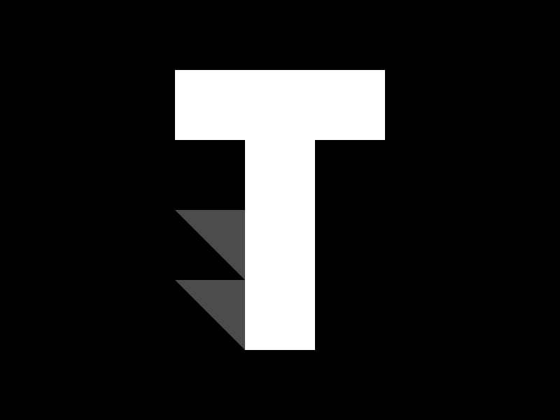

# Trackilo - Job Application Tracking System

Trackilo is a modern, full-stack job application tracking system that helps job seekers organize and monitor their job applications efficiently. With a clean, intuitive interface and powerful features, Trackilo makes it easy to keep track of your job search journey.

## Features

### Authentication & User Management
- Google OAuth integration for quick sign-in
- Secure email/password authentication
- Customizable user profiles
- Dark/Light mode theme support

### Job Application Management
- Create, edit, and delete job applications
- Track application status (Pending, Interview, Declined)
- Add detailed job information:
  - Company name
  - Position
  - Job location
  - Application status
  - Job type (Full-time, Part-time, Remote, etc.)
  - Application date

### Dashboard & Analytics
- Visual statistics dashboard
- Monthly applications overview
- Status-wise application breakdown
- Job type distribution charts
- Search and filter capabilities
- Pending applications tracking
- Interview scheduling overview

### User Experience
- Responsive design for all devices
- Intuitive navigation
- Real-time updates
- Clean and modern UI
- Seamless dark mode integration
- Loading states and animations
- Form validation and error handling

## Tech Stack

### Frontend
- **React.js** - UI library
- **Styled Components** - Styling and theming
- **React Icons** - Icon library
- **React Router** - Navigation
- **Context API** - State management
- **Axios** - HTTP client
- **Chart.js** - Data visualization

### Backend
- **Node.js** - Runtime environment
- **Express.js** - Web framework
- **MongoDB** - Database
- **Mongoose** - ODM
- **JWT** - Authentication
- **Passport** - OAuth integration
- **Bcrypt** - Password hashing

### Development & Deployment
- **Git** - Version control
- **npm** - Package management
- **ESLint** - Code linting
- **Prettier** - Code formatting

## 🔥 Key Features in Development

- Email notifications for application updates
- Calendar integration for interview scheduling
- Resume/CV attachment support
- Application deadline reminders
- Company research notes section
- Interview preparation resources
- Multi-language support